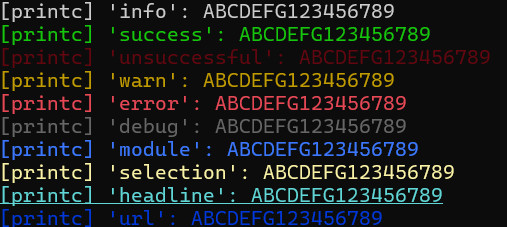

# Peek-A-Boo Developer Guide

This guide explains how to develop new modules for the Peek-A-Boo framework, enabling you to extend the platform with custom tools for OSINT, reconnaissance, privilege escalation, and more.
___
## Module Structure

Each module must inherit from `BaseModule` located in `modules/base.py`. A typical module looks like this:

```python
from modules.base import BaseModule
from core.utils.formatter import printc

class Module(BaseModule):
    def __init__(self):
        super().__init__()
        self.name = "module_name"
        self.description = "What this module does"
        self.category = "recon | osint | privilege_escalation | utility"
        self.author = "Your Name"
        self.author_email = "you@example.com"
        self.url = "https://..."
        self.license = "MIT"
        self.version = "0.0.1"

        self.default_options = {
            "example_option": "default_value"
        }

        self.required_options = ["example_option"]
        self.options = self.default_options.copy()

    def requires(self):
        return []

    def run(self, shared_data):
        printc(f"[{self.name}] example_option = {self.options['example_option']}", level="module")
        shared_data["your_module_output"] = "some_value"
```
___
## Key Concepts

### Categories

Modules should be categorized properly to ensure clarity and organization:
- `osint`
- `recon`
- `privilege_escalation`
- `utility`

These values go into `self.category`.

### Required Fields

Each module **must** define:
- `self.name`
- `self.description`
- `self.category`
- `self.version`
- `self.default_options` and `self.required_options`

### Shared Data System

Modules communicate using `shared_data`, a dictionary passed to all modules. Use it to:
- Read: `shared_data.get("some_key")`
- Write: `shared_data["some_key"] = value`

This enables chaining:
```python
# Module A stores:
shared_data["sudo_version"] = (1, 9, 17, 1)

# Module B reads:
version = shared_data.get("sudo_version")
```

### Dependencies Between Modules

Use the `requires()` method to declare dependencies:
```python
def requires(self):
    return ["pb_check_sudo_version"]
```

### Logging and Output

Use `printc()` to display messages with formatting:
```python
printc("Info message", level="info")
printc("Success", level="success")
printc("Error occurred", level="error")
```




Defined levels:
- `info`, `success`, `unsuccessful`, `warn`, `error`, `debug`, `module`, `selection`, `headline`, `url`

___
## Tools Available

### Output Formatter

Located at `core/utils/formatter.py`, contains:
- `printc()` — Colorized console output
- `colorize()` — Inline rich formatting

### SSH Handler

Located at `core/utils/ssh_handler.py`, contains:
- `create_ssh_client()`
- `ssh_exec()`
- `sftp_upload()` / `sftp_download()`

### Progress Bar

Located at `core/utils/progress_bar.py`, contains:
**Functions:**
- `create_spinner(style)` — Returns a generator that cycles spinner characters
- `progress_bar(bar_len, completed, total, start_time, spinner_cycle)` — Draws the bar in-place

**Spinner styles:**
- `"braille"` → ⠋⠙⠹⠸⠼⠴...
- `"arc"`     → ◜◠◝◞◡◟
- `"dot"`     → ⠁⠂⠄⡀⢀⠠...
- `"classic"` → | / - \ \
- `"circle"`  → ◐ ◓ ◑ ◒
- `"corners"` → ▖▘▝▗

**Example usage:**

```python
from core.utils.progress_bar import create_spinner, progress_bar
import time

spinner = create_spinner("braille")
start = time.time()

for i in range(10):
    progress_bar(40, i + 1, 10, start, spinner)
    time.sleep(0.3) 
```
Displays something like:

⠋ #################### 7/10 ########............    2.3s

___


## Example: Minimal Module Template

```python
from modules.base import BaseModule
from core.utils.formatter import printc

class Module(BaseModule):
    def __init__(self):
        super().__init__()
        self.name = "pb_template"
        self.description = "Template module"
        self.category = "utility"
        self.author = "022NN"
        self.version = "0.0.1"
        self.default_options = {"example_option": "value"}
        self.required_options = ["example_option"]
        self.options = self.default_options.copy()
        
    def requires(self):
        return []

    def run(self, shared_data):
        printc(f"[{self.name}] Running", level="info")
        value = self.options["example_option"]
        printc(f"Option: {value}", level="success")
        shared_data["template_output"] = value
```
___
## Contributing

Follow standard Python practices, ensure your module:
- Uses shared_data when necessary
- Includes logging via `printc`
- Has meaningful `name`, `description`, and `category`
___
## Templates

For further, please check:

- [Template Module](templates/pb_module_template.py)

